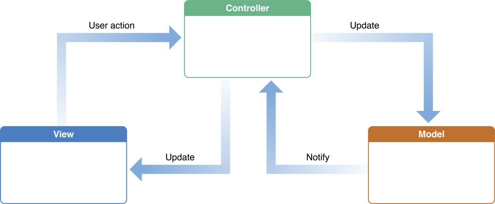
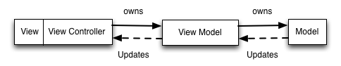
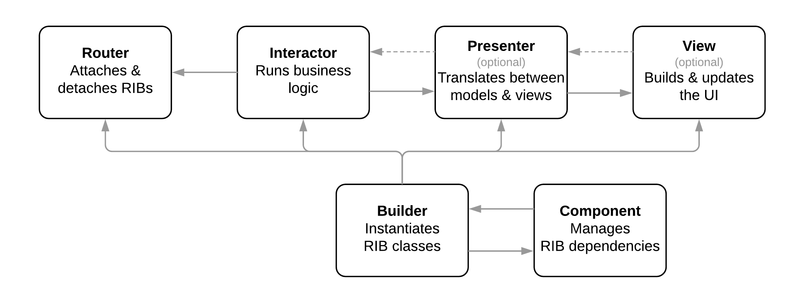

## Topics

* [Architecture](#Architecture)
* [Design Pattern](#Design-Pattern)
* [UI](#UI)
* [Communications Patterns](#Communications-Patterns)
* [Reactive Programming](#Reactive-Programming)
* [Memory Management](#Memory-Management)
* [Concurrency](#Concurrency)
* [Persist Data](#Persist-Data)
* [Debug](#Debug)
* [Languages](#Languages)
* [Others](#Other)

## Architecture

### MVC

* [Model-View-Controller](https://developer.apple.com/library/archive/documentation/General/Conceptual/DevPedia-CocoaCore/MVC.html)

  

### MVVM

* [Model-View-ViewModel](https://www.objc.io/issues/13-architecture/mvvm/)

  

* MVVM try to solve the issue of "Massive View Controller" by adding a `ViewModel` layer between `Model` and `ViewController`

1. MVVM is compatible with your existing MVC architecture.
1. MVVM makes your apps more testable.
1. MVVM works best with a binding mechanism.

### VIPER
* [View-Interactor-Presenter-Entity-Routing](https://www.objc.io/issues/13-architecture/viper/)
  

* components
  * View: displays what it is told to by the Presenter and relays user input back to the Presenter.
  * Interactor: contains the business logic as specified by a use case.
  * Presenter: contains view logic for preparing content for display (as received from the Interactor) and for reacting to user inputs (by requesting new data from the Interactor).
  * Entity: contains basic model objects used by the Interactor.
  * Routing: contains navigation logic for describing which screens are shown in which order.

### RIBs

* [Router-Interactor-Buider]((https://github.com/uber/RIBs)
  * and Presenter, View.
  

### Trade Off

#### No Sliver Bullet

There is no **Best Architecuture**, we should choose bewteen the different options based on our use-case, trade-off bewteen `complexity` and `flexibility`. MVC is good for simple & small application/page, MVVC maybe better for mid-size application/page. for large app with complicated business logic, RIBs or VIPER would be good way to go.

#### What is the difference between RIBs and MV*/VIPER

MVC, MVP, MVI, MVVM and VIPER are architecture patterns. RIBs is a framework. What differentiates RIBs from frameworks based on MV*/VIPER is:

* Business logic drives the app, not the view tree. Unlike with MV*/VIPER, a RIB does not have to have a view. This means that the app hierarchy is driven by the business logic, not the view tree.
* Independent business logic and view trees. RIBs decouple how the business logic scopes are structured from view hierarchies. This allows the application to have a deep business logic tree, isolating business logic nodes, while maintaining a shallow view hierarchy making layouts, animations and transitions easy.

## Design Pattern

## UI

## Communications Patterns

## Reactive Programming

## Memory Management

### ARC

### Retain Cycle

### Weak / Strong / Unowned

### Garbage Collection (Java)

## Concurrency

## Persist-Data

## Debug

## Languages

### Swift

### Objective-C

## Other

### Site

* [developer.apple.com/](https://developer.apple.com/)
* [swift.org](https://swift.org/)
* [objc.io](https://www.objc.io)
