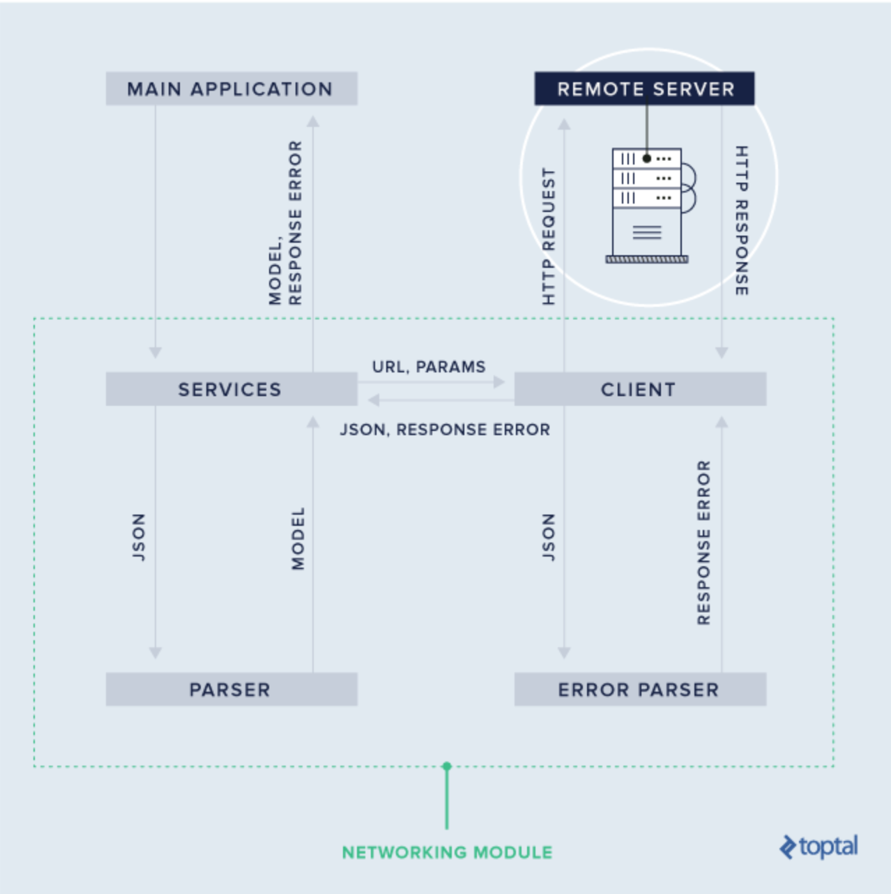
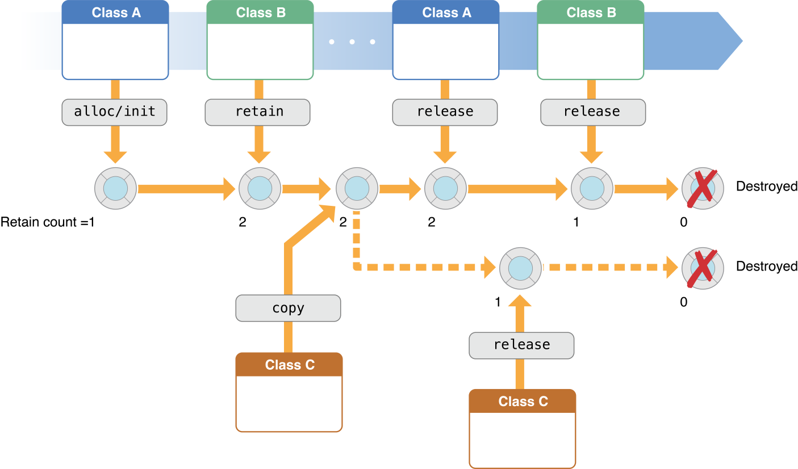

## Topics

* [Architecture](#Architecture)
* [Design Pattern](#Design-Pattern)
* [UI](#UI)
* [Networking](#Networking)
* [Communications Patterns](#Communications-Patterns)
* [Reactive Programming](#Reactive-Programming)
* [Memory Management](#Memory-Management)
* [Concurrency](#Concurrency)
* [Persist Data](#Persist-Data)
* [Debug](#Debug)
* [Languages](#Languages)
* [Others](#Other)

## Architecture

### MVC

* [Model-View-Controller](https://developer.apple.com/library/archive/documentation/General/Conceptual/DevPedia-CocoaCore/MVC.html)

  

### MVVM

* [Model-View-ViewModel](https://www.objc.io/issues/13-architecture/mvvm/)

  

* MVVM try to solve the issue of "Massive View Controller" by adding a `ViewModel` layer between `Model` and `ViewController`

  1. MVVM is compatible with your existing MVC architecture.
  1. MVVM makes your apps more testable.
  1. MVVM works best with a binding mechanism.

### VIPER

* [View-Interactor-Presenter-Entity-Routing](https://www.objc.io/issues/13-architecture/viper/)
  

* components
  * View: displays what it is told to by the Presenter and relays user input back to the Presenter.
  * Interactor: contains the business logic as specified by a use case.
  * Presenter: contains view logic for preparing content for display (as received from the Interactor) and for reacting to user inputs (by requesting new data from the Interactor).
  * Entity: contains basic model objects used by the Interactor.
  * Routing: contains navigation logic for describing which screens are shown in which order.

### RIBs

* [Router-Interactor-Buider](https://github.com/uber/RIBs)
  * and Presenter, View.
  

### Trade Off

#### No Sliver Bullet

There is no **Best Architecuture**, we should choose bewteen the different options based on our use-case, trade-off bewteen `complexity` and `flexibility`. MVC is good for simple & small application/page, MVVC maybe better for mid-size application/page. for large app with complicated business logic, RIBs or VIPER would be good way to go.

#### What is the difference between RIBs and MV*/VIPER

MVC, MVP, MVI, MVVM and VIPER are architecture patterns. RIBs is a framework. What differentiates RIBs from frameworks based on MV*/VIPER is:

* Business logic drives the app, not the view tree. Unlike with MV*/VIPER, a RIB does not have to have a view. This means that the app hierarchy is driven by the business logic, not the view tree.
* Independent business logic and view trees. RIBs decouple how the business logic scopes are structured from view hierarchies. This allows the application to have a deep business logic tree, isolating business logic nodes, while maintaining a shallow view hierarchy making layouts, animations and transitions easy.

## Design Pattern

## UI

## Networking

### Architecture Overview

* **Models**: Classes that describe the data models of our application, reflecting the structure of data received from, or sent to, the backend servers.
* **Parsers**: Responsible for decoding server responses and producing model objects.
* **Errors**: Objects to represent erroneous server responses.
* **Client**: Sends requests to backend servers and receives responses.
* **Services**: Manage logically linked operations (e.g. authentication, managing user related data, analytics, etc).

  

### Client-Server Interaction Ways

* Long/short Polling (Client Pull)
* WebSockets (Server Push)
* Server-Side Event (Server Push)

#### Short Polling

client send pull request regularly. server will response immediately.

* simple
* create unnecessary traffic, wasting bandwidth.

#### Long Polling

The server attempts to "hold open" (not immediately reply to) each HTTP request, responding only when there are events to deliver. In this way, there is always a pending request to which the server can reply for the purpose of delivering events as they occur, thereby minimizing the latency in message delivery.

* complex
* reduce centain traffic, needs more connections.

#### Websocket

A WebSocket is nothing but a persistent connection between the client and the server. This is a communications protocol providing full-duplex communication channels over a single TCP connection.

* increase the complexity, more event handlering
* better performance

#### Server Side Event

allows the server to asynchronously push the data to the client once the client-server connection is established. The server can then decide to send data whenever a new “chunk” of data is available. It can be considered as a one-way publish-subscribe model.

* Simpler implementation and Data efficiency
* one-way-communication, need combine with another way.

#### [reference](https://codeburst.io/polling-vs-sse-vs-websocket-how-to-choose-the-right-one-1859e4e13bd9)

### API Design

#### Pagination
  
* Limit/Offset Pagination
  * `GET /items?limit=20&offset=100`
  * Pros:
    * easy to implement.
    * stateless in server.

  * Cons:
    * offset has performance issue, when value is too large.
    * inconsistency if db changed (insert, delete).

  * Good for small data set

* Timebased Pagination
  * `GET /items?limit=20&created:lte:2018-01-19T00:00:00`
  * Pros:
    * with keyset, resolved the db change issue.
  * Cons:
    * more than one in same time?
    * Coupling with Filter and Sorting, increase the complexity to handle it.

  * Good for data has natural with a single natural high cardinality key such as log data.

* Seek/Cursor Pagination
  * `GET /items?limit=20&cursor=1374004777531007833`
  * extention of Seek
  * Pros
    * No coupling of pagination logic to filter logic.
    * consistent high performance
  * Cons
    * hard to implement when a custom sort order is needed.
    * If items are deleted from the database, the start_id may not be a valid id.

#### [Filtering, Sorting, and Pagination](https://www.moesif.com/blog/technical/api-design/REST-API-Design-Filtering-Sorting-and-Pagination/)

## Communications Patterns

### Delegation

protocol based 1 to 1 communication.

* Pros:
  * flexibility, straightforward.
* Cons:
  * Coupling between two objects.

### Block / Closure

Similar to the delegation, 1 to 1 communication.

* Pros:
  * Good readability as response handling logic is in same place.
* Cons:
  * need pay attention to retain cycle issue. (memory leak: use `weak` or `unowned`).

### Observation

* Listen to Events or Notifications and execution accordingly.
* Support 1 to many or many to many communication.

* Notification
* KVO API
* Pure Swift Setter

* Pros:
  * flexibility, allow communicate loosely.
  * decoupling source and consumer part.
* Cons:
  * ony way communication.
  * need to manage the observer properly.
  * race condition and thread safty issue.
  * too complex to debug.
  * performance issue if process all event without throttling or debouncing.

### Trade off

keep as simple as possible. depends on the follow factors:

* Sender and Recipients numbers
  * 1 to 1
  * 1 to many
  * many to many
* Commnunication type
  * one way communication
  * two way commnunication

* [communication-patterns](https://www.objc.io/issues/7-foundation/communication-patterns/)

## Reactive Programming

Computation based on the asynchronous data streams, a generalization of Key-Value Observing(KVO).

* [RxSwift](https://github.com/ReactiveX/RxSwift)

## Memory Management

[Memory management](https://developer.apple.com/library/archive/documentation/General/Conceptual/DevPedia-CocoaCore/MemoryManagement.html) in a Cocoa application that doesn’t use garbage collection is based on a reference counting model. When you create or copy an object, its retain count is 1. Thereafter other objects may express an ownership interest in your object, which increments its retain count. The owners of an object may also relinquish their ownership interest in it, which decrements the retain count. When the retain count becomes zero, the object is deallocated (destroyed).

  

### Automatic Reference Counting (ARC)

ARC inserts the appropriate retains and releases required for reference counting at compile time, no collector process is needed to continually sweep memory and remove unreferenced objects.

### Retain Cycle / Strong Reference Cycles

For a class instance to be fully deallocated under ARC, it needs to be free of all strong references to it. But there is a chance that you could structure your code in such a way that two instances strongly reference each other and therefore never let each other’s reference count drop down to zero.

### Weak and Unowned

There are two ways of resolving Retain Cycle in Swift: weak references and unowned references.

**Weak reference** is used when you know that a reference is allowed to become nil whereas **unowned reference** is used when you are certain that the reference has a longer lifecycle and will never become nil. Since **weak references** can have a value or no value at all, they must be defined as optional variables. An **unowned reference** has to be defined as non-optional since it is assumed to always have a value.

### Garbage Collection

Runtime detects unused objects and object graphs in the background. This happens at intermediate intervals, either after a certain amount of time has passed or when the runtime memory gets low, and not released at that exact moment.

### ARC vs GC

Both GC and ARC aim to free developer from memory management, though **it doesn't completely free you from worrying about memory management.**

* GC is Runtime will ARC is compile-time.
* ARC is real-time release while frees an object "sometime later".
* GC can cope with retain cycles while ARC can not.
* Typically, **garbage collection** has certain disadvantages, including consuming additional resources, performance impacts, possible stalls in program execution, and incompatibility with manual resource management.

* [Garbage Collection vs Automatic Reference Counting](https://medium.com/computed-comparisons/garbage-collection-vs-automatic-reference-counting-a420bd4c7c81)

## Concurrency

## Persist-Data

## Debug

## Languages

### Swift

### Objective-C

## Other

### Site

* [developer.apple.com/](https://developer.apple.com/)
* [swift.org](https://swift.org/)
* [objc.io](https://www.objc.io)
